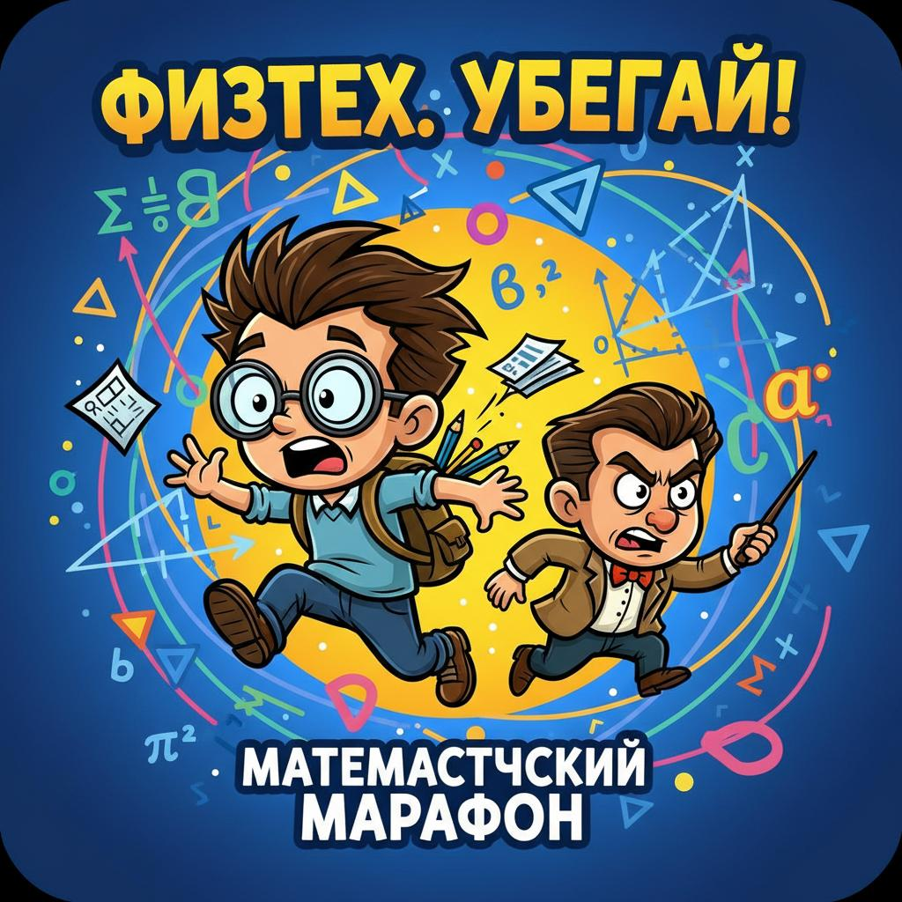

# Физтех Хоррор (MFTI Horror)

**3D хоррор-бродилка про студента Московского Физико-Технического Института**



## Описание

Ты - студент МФТИ (физтеха). Сессия на носу, и тебе нужно собрать все интегралы, разбросанные по коридорам института, чтобы сдать экзамены. Но будь осторожен! Злые преподаватели бродят по коридорам и хотят тебя поймать!

## Геймплей

- **Цель**: Собрать все 5 интегралов, разбросанных по зданию
- **Опасность**: Преподаватели патрулируют коридоры и преследуют тебя, если заметят
- **Выносливость**: Бег расходует выносливость - используй её с умом!

## Управление

| Клавиша | Действие |
|---------|----------|
| `W, A, S, D` | Движение |
| `Shift` | Бег (расходует выносливость) |
| `E` | Взаимодействие с объектами |
| `Escape` | Пауза |
| `Мышь` | Осмотр вокруг |

## Уровни сложности

1. **Легко (Зачет)** - 2 преподавателя, маленькая зона обнаружения
2. **Нормально (Экзамен)** - 3 преподавателя, стандартная сложность
3. **Сложно (Сессия)** - 5 преподавателей, большая зона обнаружения
4. **ФИЗТЕХ (Ад)** - 7 преподавателей, максимальная сложность!

## Интегралы

В игре можно найти интегралы разной сложности:

- 🟢 **Простые**: ∫x dx, ∫x² dx
- 🟡 **Средние**: ∫sin(x) dx, ∫cos(x) dx, ∫e^x dx
- 🔴 **Сложные**: ∫ln(x) dx, ∫x·e^x dx
- 🟣 **Легендарные**: ∫e^(-x²) dx (интеграл Пуассона!)

## Технологии

- **Unity** (C# скрипты для полной версии)
- **Three.js** (WebGL версия)
- Процедурная генерация уровней
- ИИ преподавателей с патрулированием и преследованием

## Структура проекта

```
mfti-horror-game/
├── Assets/
│   ├── Scripts/           # C# скрипты для Unity
│   │   ├── PlayerController.cs
│   │   ├── TeacherAI.cs
│   │   ├── Integral.cs
│   │   ├── GameManager.cs
│   │   ├── UIManager.cs
│   │   ├── Door.cs
│   │   ├── InventoryManager.cs
│   │   ├── HidingSpot.cs
│   │   └── LevelGenerator.cs
│   └── Textures/          # Текстуры и изображения
├── Build/                 # Веб-версия игры
│   ├── index.html
│   └── game.js
└── README.md
```

## Скрипты

### PlayerController.cs
Управляет движением игрока, выносливостью, сбором интегралов.

### TeacherAI.cs
Искусственный интеллект преподавателей:
- Патрулирование по заданным точкам
- Обнаружение игрока в поле зрения
- Преследование при обнаружении
- Разные типы преподавателей (Матан, Линал, Теормех, Физика, Программирование)

### Integral.cs
Система сбора интегралов:
- Вращение и анимация
- Разные формулы и сложности
- Эффекты при сборе

### GameManager.cs
Управление игровым процессом:
- Состояние игры
- Спавн врагов и предметов
- Победа/поражение
- Сложность

### LevelGenerator.cs
Процедурная генерация уровней:
- Создание комнат и коридоров
- Размещение декораций
- Точки спавна

## Запуск

### Web-версия
Просто откройте `Build/index.html` в браузере или посетите задеплоенную версию.

### Unity версия
1. Откройте проект в Unity 2020.3+
2. Загрузите сцену `MainScene`
3. Нажмите Play

## Автор

Создано с любовью к физтеху и математике ❤️

## Лицензия

Free to play! Удачи на сессии!
